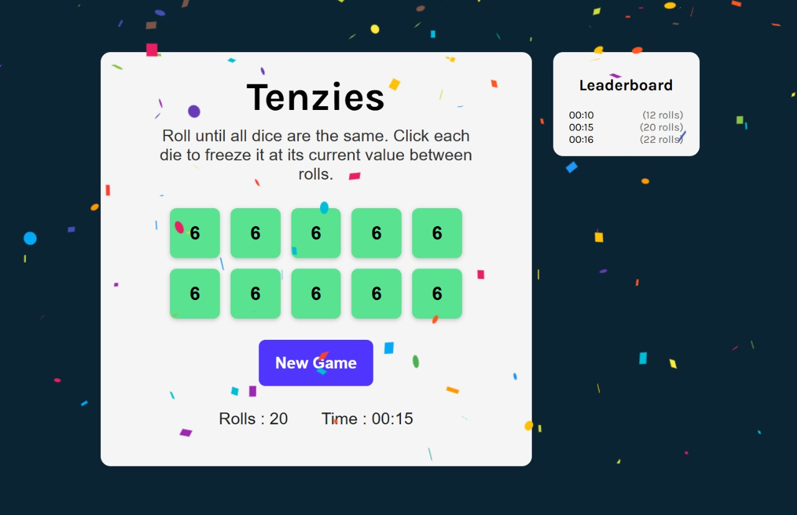

# 🎲 Tenzies Game

A simple and fun dice game built with **React** where the goal is to roll all ten dice until they are the same. You can hold any die to keep its value and roll the rest.

## 🔗 Live Demo

[Click here to play Tenzies!](https://tenzies-henna-ten.vercel.app/)

---

## 📸 Screenshot

 

---

## 🚀 Features

- 🎯 Roll until all dice show the same number
- 🧊 Click on a die to "hold" it at its current value
- 🕒 Timer starts on first interaction
- 🏆 Tracks best score (lowest time)
- 🧮 Leaderboard of top 10 times using localStorage
- 🎮 New game resets the board but preserves top scores

---

## 🛠️ Tech Stack

- React (with Hooks like `useState`, `useEffect`, `useRef`)
- JavaScript
- CSS
- Vite (for development & build)
- LocalStorage (to persist best scores)

---

## 💡 What I Learned

This project helped reinforce key React concepts like:

- Managing state effectively using `useState`
- Conditional rendering and component composition
- Side effects with `useEffect` (e.g., starting/stopping timers)
- Handling time and formatting with helper functions
- Integrating browser `localStorage` for persistent data
- Debugging re-renders and effect dependencies

---

## 📦 Installation

```bash
git clone https://github.com/Shubhan9/tenzies.git
cd tenzies
npm install
npm run dev
